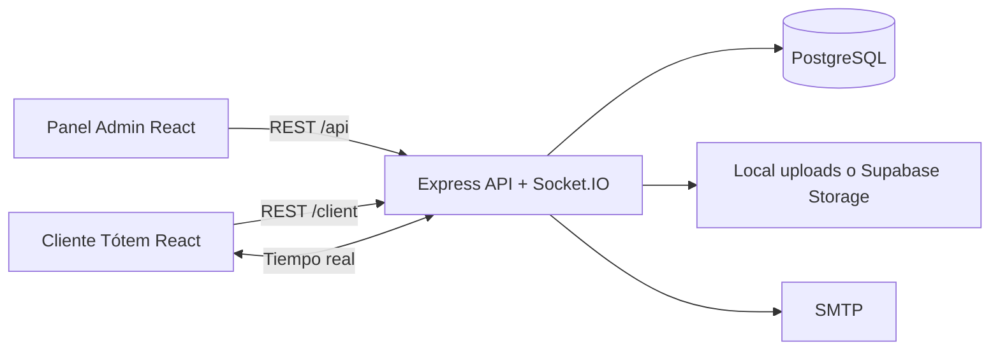

# TOTEM


Sistema web para administrar, asignar y visualizar contenido en tótems digitales. El proyecto incluye un panel administrativo, un cliente público para el dispositivo tótem, autenticación con sesiones, gestión de usuarios por rol, contenidos multimedia, notificaciones, asignaciones programadas, modo preguntas sobre PDFs y comunicación en tiempo real.

> [!IMPORTANT]
> Este repositorio está organizado como monorepo: `backend/` contiene la API y `frontend/` contiene la aplicación React. Cada carpeta tiene sus propias dependencias, variables de entorno y comandos.

---

## Descripción General

**TOTEM** permite que una institución administre contenido informativo para pantallas tipo tótem. Desde el panel administrativo se pueden registrar tótems, crear contenidos, configurar asignaciones, publicar notificaciones y controlar usuarios. Desde el cliente de tótem se muestra el contenido asignado, se reporta estado de conexión, se reciben eventos en tiempo real y se habilita un modo de preguntas sobre documentos PDF.

El sistema cubre tres experiencias principales:

| Experiencia | Ruta | Propósito |
| --- | --- | --- |
| Panel administrativo | `/admin` | Gestión de usuarios, dashboard, tótems, contenidos, notificaciones y asignaciones. |
| Cliente del tótem | `/client/totem` | Pantalla pública que se vincula a un tótem y reproduce el contenido asignado. |
| API backend | `/api` y `/client` | Servicios REST, sesiones, archivos, búsqueda PDF, estado del cliente y Socket.IO. |

---

## Módulos Principales

| Módulo | Funcionalidades |
| --- | --- |
| Autenticación | Login, logout, sesión persistente, cambio de contraseña, recuperación por correo e invitaciones de usuario. |
| Usuarios | CRUD de usuarios, roles `Admin` y `SuperAdmin`, estados `active`, `inactive` e `invited`. |
| Dashboard | Resumen operativo, alertas, tótems con incidencias y asignaciones próximas a expirar. |
| Tótems | Alta, edición, baja lógica, estado activo/inactivo, conexión online/offline y códigos de vinculación. |
| Cliente tótem | Vinculación por código, refresh de sesión, heartbeat, reporte de estado y bootstrap inicial. |
| Contenidos | Imágenes, videos, noticias, publicidades y PDFs con validaciones de archivo. |
| Asignaciones | Programación de contenido por tótem, por varios tótems o para todos los tótems activos. |
| Notificaciones | Mensajes normales o urgentes, alcance global, por campus o por tótems específicos. |
| Emergencias | Endpoint público para enviar eventos de emergencia a un tótem. |
| Modo preguntas | Extracción de preguntas/respuestas desde PDFs, búsqueda por FTS/trigram y respuestas con imágenes asociadas. |
| Tiempo real | Socket.IO para sincronizar contenido, notificaciones, estado y eventos del cliente tótem. |
| Archivos | Almacenamiento local o Supabase Storage para multimedia, PDFs e imágenes de preguntas. |

---

## Arquitectura



### Flujo del backend

```text
routes -> controllers -> services -> repositories -> models/database
```

| Capa | Responsabilidad |
| --- | --- |
| `routes` | Define endpoints, middlewares y validadores. |
| `controllers` | Recibe la petición HTTP y responde al cliente. |
| `services` | Contiene reglas de negocio y orquesta operaciones. |
| `repositories` | Encapsula consultas a base de datos. |
| `models` | Define tablas, relaciones y validaciones de Sequelize. |
| `middlewares` | Autenticación, seguridad, subida de archivos y manejo de errores. |
| `validators` | Normaliza y valida entrada de usuario. |

### Flujo del frontend

```text
routes -> pages -> features -> components/hooks/services -> api
```

| Capa | Responsabilidad |
| --- | --- |
| `routes` | Enrutamiento, protección de rutas y redirecciones. |
| `pages` | Pantallas completas asociadas a rutas. |
| `features` | Código agrupado por funcionalidad de negocio. |
| `components` | Componentes reutilizables y genéricos. |
| `hooks` | Lógica reutilizable con estado. |
| `services` | Comunicación con la API. |
| `types` | Tipos TypeScript compartidos. |
| `utils` | Funciones auxiliares. |

---

## Stack Tecnológico

| Área | Tecnologías |
| --- | --- |
| Frontend | React 19, TypeScript, Vite, TailwindCSS, React Router, Lucide React. |
| Cliente tótem | MediaPipe Tasks Vision, React Speech Recognition, Socket.IO Client. |
| Backend | Node.js, Express 5, Sequelize, pg, Express Session. |
| Base de datos | PostgreSQL, `pg_trgm`, índices FTS en español. |
| Tiempo real | Socket.IO. |
| Seguridad | Helmet, CORS con credenciales, rate limiting, bcrypt, cookies HTTP-only. |
| Archivos | Multer, almacenamiento local, Supabase Storage opcional. |
| PDF | `pdf-parse`, extracción de texto, fragmentos de preguntas y respuestas. |
| Correo | Nodemailer con SMTP. |

---

## Requisitos Previos

Antes de ejecutar el proyecto necesitas:

- Node.js LTS y npm.
- PostgreSQL.
- Git.
- Un usuario/base de datos de PostgreSQL configurados.
- Servidor SMTP si se usarán recuperación de contraseña e invitaciones.
- Cuenta y bucket de Supabase Storage solo si `STORAGE_PROVIDER=supabase`.

> [!NOTE]
> Para el modo preguntas sobre PDFs, las migraciones crean la extensión `pg_trgm`. El usuario de base de datos debe tener permisos para crear extensiones o la extensión debe existir previamente.

---

## Instalación y Ejecución

### 1. Clonar el repositorio

```bash
git clone https://github.com/CB-PROYECTO-SISTEMAS-2026/PR2-26-TOTEM.git
cd PR2-26-TOTEM
```

### 2. Configurar el backend

```bash
cd backend
npm install
copy .env.example .env
```

Edita `backend/.env` con los datos reales de PostgreSQL, sesiones, SMTP y almacenamiento.

### 3. Preparar base de datos

```bash
npm run db:migrate
```

### 4. Crear usuario SuperAdmin inicial

```bash
npm run db:seed:admin
```

Este seeder crea o actualiza el primer usuario administrativo:

| Campo | Valor |
| --- | --- |
| Nombre | `Juan Perez` |
| Correo | `superadmin@gmail.com` |
| Contraseña | `Qqwerty8!` |
| Rol | `SuperAdmin` |

> [!IMPORTANT]
> Usa esta cuenta para el primer ingreso al panel y cambia la contraseña después de acceder.

### 5. Levantar backend

```bash
npm run dev
```

Por defecto queda disponible en:

```text
http://localhost:3000
```

### 6. Configurar el frontend

En otra terminal:

```bash
cd frontend
npm install
copy .env.example .env
```

Edita `frontend/.env` si el backend no está en `http://localhost:3000`.

### 7. Levantar frontend

```bash
npm run dev
```

Por defecto queda disponible en:

```text
http://localhost:5173
```

---

## Variables de Entorno

### Backend

Archivo: `backend/.env`

| Variable | Propósito | Valor común |
| --- | --- | --- |
| `PORT` | Puerto HTTP del backend. | `3000` |
| `NODE_ENV` | Entorno de ejecución. | `development` |
| `FRONTEND_URL` | Origen permitido para CORS y cookies. | `http://localhost:5173` |
| `PGHOST`, `PGPORT`, `PGDATABASE`, `PGUSER`, `PGPASSWORD` | Conexión PostgreSQL. | Según ambiente |
| `PGSSL`, `PGSSLMODE`, `PGSSL_CA_CERT_PATH`, `PGSSL_CA_CERT` | Conexión TLS para bases remotas. | `false` local |
| `SESSION_SECRET` | Secreto para firmar sesiones. | Valor largo y seguro |
| `SESSION_COOKIE_NAME` | Nombre de cookie de sesión. | `totem.sid` |
| `SESSION_MAX_AGE_MS` | Duración de sesión admin. | `28800000` |
| `STORAGE_PROVIDER` | Proveedor de archivos. | `local` o `supabase` |
| `LOCAL_UPLOAD_DIR` | Carpeta local de archivos. | `uploads` |
| `PUBLIC_FILES_URL` | URL pública base de archivos. | `http://localhost:3000/uploads` |
| `SUPABASE_URL`, `SUPABASE_SERVICE_ROLE_KEY`, `SUPABASE_STORAGE_BUCKET` | Credenciales de Supabase Storage. | Solo con Supabase |
| `SMTP_HOST`, `SMTP_PORT`, `SMTP_USER`, `SMTP_PASS`, `SMTP_FROM` | Envío de correos. | Según proveedor SMTP |
| `PASSWORD_RESET_*` | Tokens y ruta de recuperación de contraseña. | Ver `.env.example` |
| `USER_INVITATION_*` | Tokens y ruta de invitación de usuarios. | Ver `.env.example` |
| `TOTEM_CLIENT_*` | Tokens del cliente tótem. | Ver `.env.example` |
| `TOTEM_QUESTION_*` y `TOTEM_QA_*` | Tiempos y ponderaciones del modo preguntas. | Ver `.env.example` |
| `TOTEM_WEATHER_*` | Cache y timeout del clima. | Ver `.env.example` |

<details>
<summary>Ejemplo completo de backend/.env</summary>

```env
PORT=3000
NODE_ENV=development
FRONTEND_URL=http://localhost:5173

STORAGE_PROVIDER=local
LOCAL_UPLOAD_DIR=uploads
PUBLIC_FILES_URL=http://localhost:3000/uploads

SUPABASE_URL=
SUPABASE_SERVICE_ROLE_KEY=
SUPABASE_STORAGE_BUCKET=totem-contents

PGHOST=localhost
PGPORT=5432
PGDATABASE=nombre_db
PGUSER=tu_usuario
PGPASSWORD=tu_password
PG_CONNECTION_TIMEOUT_MS=10000
PG_POOL_MAX=5
SEQUELIZE_POOL_MAX=5
PGSSL=false
PGSSLMODE=disable
PGSSL_REJECT_UNAUTHORIZED=true
PGSSL_CA_CERT_PATH=
PGSSL_CA_CERT=
DB_LOGGING=true

DASHBOARD_ASSIGNMENT_EXPIRING_SOON_HOURS=24
DASHBOARD_SUMMARY_CACHE_TTL_MS=30000
CONTENT_UNAVAILABLE_FILE_CHECK_CACHE_TTL_MS=45000
CONTENT_FILE_AVAILABILITY_CHECK_CONCURRENCY=8

SESSION_SECRET=coloca_aqui_una_clave_larga_y_segura
SESSION_COOKIE_NAME=totem.sid
SESSION_MAX_AGE_MS=28800000
SESSION_TABLE_NAME=user_sessions
PASSWORD_SALT_ROUNDS=12

PASSWORD_RESET_TOKEN_TTL_MINUTES=30
PASSWORD_RESET_TOKEN_BYTES=32
PASSWORD_RESET_FRONTEND_PATH=/admin/reset-password

SMTP_HOST=smtp.gmail.com
SMTP_PORT=465
SMTP_SECURE=true
SMTP_USER=tu_cuenta@gmail.com
SMTP_PASS=tu_password_de_aplicacion
SMTP_FROM=TOTEM <tu_cuenta@gmail.com>
EMAIL_APP_NAME=TOTEM
EMAIL_LOGO_URL=

TOTEM_QUESTION_MODE_IDLE_TIMEOUT_SECONDS=8
TOTEM_QUESTION_MODE_REACTIVATION_COOLDOWN_SECONDS=2
TOTEM_QUESTION_SESSION_IDLE_TIMEOUT_SECONDS=20
TOTEM_QA_SEARCH_MIN_TRIGRAM_SCORE=0.18
TOTEM_QA_SEARCH_MIN_COMBINED_SCORE=0.12
TOTEM_QA_SEARCH_FTS_WEIGHT=0.72
TOTEM_QA_SEARCH_TRIGRAM_WEIGHT=0.28
TOTEM_QA_MIN_QUERY_WORD_COUNT=3
TOTEM_QA_MIN_QUERY_CHARACTER_COUNT=6
TOTEM_QA_MIN_QUERY_WORD_COVERAGE=0.5
TOTEM_QA_MIN_MATCHED_QUESTION_COVERAGE=0.6
TOTEM_QA_MIN_WORD_OVERLAP=2

TOTEM_CLIENT_ACCESS_TOKEN_TTL_SECONDS=900
TOTEM_CLIENT_REFRESH_TOKEN_TTL_SECONDS=157680000
TOTEM_LINK_CODE_TTL_MINUTES=10
TOTEM_WEATHER_CACHE_TTL_SECONDS=600
TOTEM_WEATHER_REQUEST_TIMEOUT_MS=4500

USER_INVITATION_TOKEN_TTL_HOURS=24
USER_INVITATION_TOKEN_BYTES=32
USER_INVITATION_FRONTEND_PATH=/set-password
```

</details>

### Frontend

Archivo: `frontend/.env`

| Variable | Propósito | Valor común |
| --- | --- | --- |
| `VITE_APP_NAME` | Nombre mostrado por la aplicación. | `TOTEM` |
| `VITE_API_URL` | URL base del backend. | `http://localhost:3000` |

```env
VITE_APP_NAME=TOTEM
VITE_API_URL=http://localhost:3000
```

---

## Scripts Disponibles

### Backend

| Comando | Descripción |
| --- | --- |
| `npm run dev` | Inicia el backend con `nodemon`. |
| `npm start` | Inicia el backend con Node.js. |
| `npm run db:migrate` | Ejecuta migraciones pendientes. |
| `npm run db:migrate:undo` | Revierte la última migración. |
| `npm run db:migrate:undo:all` | Revierte todas las migraciones. |
| `npm run db:seed:admin` | Crea o actualiza el usuario `SuperAdmin` inicial. |

### Frontend

| Comando | Descripción |
| --- | --- |
| `npm run dev` | Inicia Vite en modo desarrollo. |
| `npm run build` | Compila TypeScript y genera el build de producción. |
| `npm run preview` | Sirve localmente el build generado. |

---

## Rutas de la Aplicación

### Públicas

| Ruta | Pantalla |
| --- | --- |
| `/` | Redirección a dashboard o login según sesión. |
| `/admin/login` | Login administrativo. |
| `/admin/forgot-password` | Solicitud de recuperación de contraseña. |
| `/admin/reset-password` | Restablecimiento de contraseña. |
| `/set-password` | Activación de usuario invitado. |
| `/client/totem` | Cliente público para el dispositivo tótem. |

### Administrativas protegidas

| Ruta | Propósito |
| --- | --- |
| `/admin/dashboard` | Indicadores y alertas operativas. |
| `/admin/notifications` | Gestión de notificaciones. |
| `/admin/totems` | Gestión de tótems. |
| `/admin/contents` | Gestión de contenidos. |
| `/admin/contents/:id/question-images` | Imágenes asociadas a preguntas extraídas de PDF. |
| `/admin/assignments` | Listado de asignaciones de contenido. |
| `/admin/assignments/new` | Creación de asignaciones. |
| `/admin/assignments/:id/edit` | Edición de asignaciones. |
| `/admin/users` | Gestión de usuarios, solo `SuperAdmin`. |

---

## API Backend

### Endpoints de sistema

| Método | Ruta | Descripción |
| --- | --- | --- |
| `GET` | `/` | Estado general y listado de grupos de endpoints. |
| `GET` | `/api/health` | Health check del backend. |
| `GET` | `/api/db-test` | Prueba de conexión a PostgreSQL. |
| `GET` | `/uploads/*` | Archivos públicos cuando se usa almacenamiento local. |

### Endpoints administrativos

| Grupo | Base | Acceso |
| --- | --- | --- |
| Auth | `/api/auth` | Público para login/reset, autenticado para `me`, logout y cambio de contraseña. |
| Usuarios | `/api/users` | `SuperAdmin`. |
| Campus | `/api/campuses` | `Admin`, `SuperAdmin`. |
| Dashboard | `/api/dashboard` | `Admin`, `SuperAdmin`. |
| Tótems | `/api/totems` | `Admin`, `SuperAdmin`. |
| Contenidos | `/api/contents` | `Admin`, `SuperAdmin`. |
| Asignaciones | `/api/totem-contents` | `Admin`, `SuperAdmin`. |
| Notificaciones | `/api/notifications` | `Admin`, `SuperAdmin`. |
| Emergencias | `/api/emergency/:id/emergency` | Público para enviar urgencias a un tótem específico. |

### Endpoints del cliente tótem

| Método | Ruta | Descripción |
| --- | --- | --- |
| `POST` | `/client/totem/link` | Vincula un dispositivo con un código generado desde admin. |
| `POST` | `/client/totem/session/refresh` | Renueva tokens del cliente tótem. |
| `POST` | `/client/totem/session/unlink` | Desvincula la sesión del dispositivo. |
| `GET` | `/client/totem/bootstrap` | Obtiene configuración inicial, contenido, clima y estado. |
| `POST` | `/client/totem/heartbeat` | Reporta actividad y mantiene estado online. |
| `POST` | `/client/totem/device-status` | Reporta permisos y estado del dispositivo. |
| `POST` | `/client/totem/question-mode/enter` | Activa modo preguntas. |
| `POST` | `/client/totem/question-mode/activity` | Reporta actividad dentro del modo preguntas. |
| `POST` | `/client/totem/question-mode/exit` | Finaliza modo preguntas. |
| `POST` | `/client/totem/question-sessions` | Inicia una sesión de preguntas. |
| `POST` | `/client/totem/question-sessions/:sessionId/questions` | Envía pregunta y recibe respuesta. |
| `POST` | `/client/totem/question-sessions/:sessionId/end` | Finaliza la sesión de preguntas. |

---

## Base de Datos

El backend usa PostgreSQL con Sequelize y migraciones versionadas.

### Tablas principales

| Tabla | Descripción |
| --- | --- |
| `app_user` | Usuarios administrativos. |
| `campuses` | Sedes/campus. |
| `totems` | Dispositivos tótem registrados. |
| `contents` | Contenidos multimedia y documentos. |
| `totem_contents` | Asignaciones de contenido a tótems. |
| `notifications` | Notificaciones publicadas. |
| `notification_targets` | Alcance de cada notificación. |
| `totem_device_sessions` | Sesiones y tokens del cliente tótem. |
| `totem_question_sessions` | Sesiones del modo preguntas. |
| `pdf_documents` | PDF procesados para preguntas. |
| `pdf_chunks` | Preguntas/respuestas extraídas de PDFs. |
| `pdf_question_images` | Imágenes asociadas a preguntas PDF. |
| `password_reset_tokens` | Tokens de recuperación de contraseña. |
| `user_invitations` | Invitaciones de usuarios nuevos. |

### Migraciones

```bash
cd backend
npm run db:migrate
```

Las migraciones crean índices, restricciones, relaciones, campos de auditoría, soporte de soft delete y estructuras para sesiones, PDF, campus, notificaciones, invitaciones y almacenamiento.

---

## Contenidos y Archivos

| Tipo | Archivo requerido | Extensiones comunes | Tamaño máximo |
| --- | --- | --- | --- |
| `image` | Sí | `.jpg`, `.jpeg`, `.png`, `.webp`, `.gif`, `.bmp`, `.svg` | 15 MB |
| `video` | Sí | `.mp4`, `.webm`, `.ogg`, `.mov`, `.avi` | 150 MB |
| `advertisement` | Sí | `.jpg`, `.jpeg`, `.png`, `.webp`, `.gif`, `.bmp`, `.svg` | 15 MB |
| `news` | No | `.jpg`, `.jpeg`, `.png`, `.webp`, `.gif` | 25 MB |
| `pdf` | Sí | `.pdf` | 25 MB |

### Imágenes de preguntas PDF

Las imágenes de apoyo para preguntas extraídas de PDFs se administran desde `/admin/contents/:id/question-images`.

| Límite | Valor |
| --- | --- |
| Imágenes por pregunta | 4 |
| Tamaño máximo por imagen | 15 MB |

### Límites de contenido por asignación

| Tipo | Límite |
| --- | --- |
| Imágenes | 8 |
| Videos | 3 |
| Publicidades | 5 |
| Noticias | 6 |
| PDFs | 3 |

---

## Estructura del Proyecto

```text
PR2-26-TOTEM/
|-- database/
|   |-- 01_schema.sql
|   |-- 02_seed.sql
|   |-- README_BD.md
|-- backend/
|   |-- certs/
|   |-- database/
|   |   |-- config/
|   |   |-- migrations/
|   |   |-- models/
|   |   `-- seeders/
|   |-- src/
|   |   |-- config/
|   |   |-- controllers/
|   |   |-- errors/
|   |   |-- middlewares/
|   |   |-- repositories/
|   |   |-- routes/
|   |   |-- services/
|   |   |-- utils/
|   |   |-- validators/
|   |   `-- server.js
|   |-- tests/
|   |-- uploads/
|   |-- .dockerignore
|   |-- .env.example
|   |-- Dockerfile
|   `-- package.json
|-- frontend/
|   |-- assets/
|   |-- public/
|   |-- src/
|   |   |-- components/
|   |   |-- constants/
|   |   |-- context/
|   |   |-- features/
|   |   |-- hooks/
|   |   |-- layouts/
|   |   |-- pages/
|   |   |-- routes/
|   |   |-- services/
|   |   |-- types/
|   |   |-- utils/
|   |   |-- App.tsx
|   |   `-- main.tsx
|   |-- .dockerignore
|   |-- .env.example
|   |-- Dockerfile
|   |-- nginx.conf
|   `-- package.json
|-- .env.example
|-- docker-compose.yml
|-- README_DOCKER.md
`-- README.md
```

---

## Notas Operativas

> [!CAUTION]
> No subas archivos `.env`, claves SMTP, claves de Supabase, certificados privados ni credenciales de base de datos al repositorio.

### Sesiones y seguridad

- El panel usa sesiones con `express-session` y cookies HTTP-only.
- En producción, `NODE_ENV=production` activa cookies seguras y `sameSite=none`.
- `FRONTEND_URL` debe coincidir con el origen real del frontend.
- Login, recuperación y reset de contraseña tienen rate limiting.

### Archivos

- En modo local, los archivos se guardan bajo `backend/uploads`.
- `PUBLIC_FILES_URL` debe apuntar a la URL pública desde donde el frontend puede leerlos.
- En modo Supabase, se requieren `SUPABASE_URL`, `SUPABASE_SERVICE_ROLE_KEY` y `SUPABASE_STORAGE_BUCKET`.

### Correos

- Recuperación de contraseña e invitaciones dependen de SMTP.

### Cliente tótem

- Primero se crea o selecciona un tótem en el panel.
- Luego se genera un código de vinculación.
- El cliente en `/client/totem` usa ese código para obtener tokens.
- El dispositivo reporta heartbeat y recibe actualizaciones por Socket.IO.

### Modo preguntas

- El contenido PDF se procesa y se divide en preguntas/respuestas.
- La búsqueda combina FTS en español y similitud trigram.
- Las imágenes de apoyo por pregunta se administran desde `/admin/contents/:id/question-images`, con un máximo de 4 imágenes por pregunta y 15 MB por imagen.

---

## Estado del Proyecto

El proyecto se encuentra terminado funcionalmente y contiene:

- API REST con Express y PostgreSQL.
- Frontend administrativo con React y TypeScript.
- Cliente público para tótems.
- Autenticación por sesiones y roles.
- Gestión completa de usuarios, tótems, contenidos, asignaciones y notificaciones.
- Vinculación de dispositivos tótem.
- Comunicación en tiempo real con Socket.IO.
- Almacenamiento local o Supabase Storage.
- Procesamiento de PDFs para modo preguntas.
- Migraciones versionadas con Sequelize CLI.
